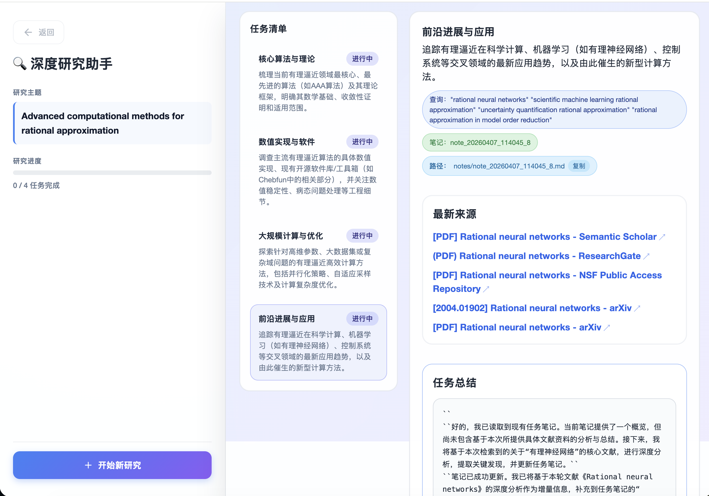
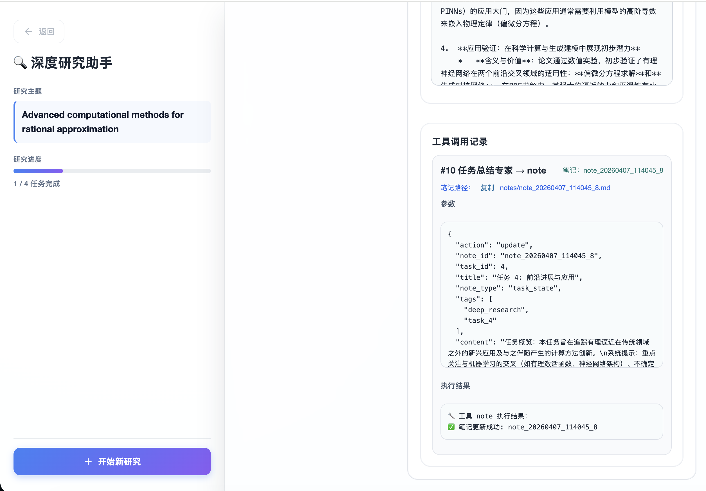
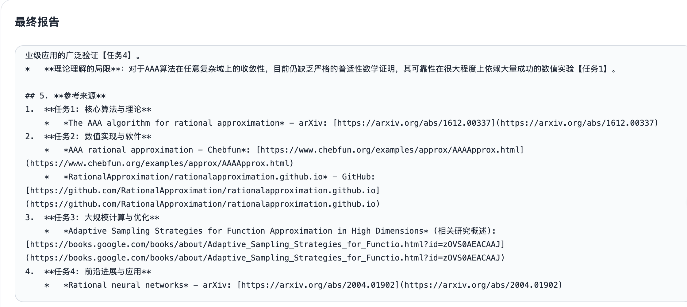

# Coconut Research Assistant

A full-stack research agent application for planning, executing, and synthesizing multi-step web research.

It combines agent orchestration, streaming execution, structured task handling, and report generation in a UI that makes intermediate reasoning artifacts visible and reviewable.

## What It Does

- breaks a research topic into actionable tasks
- runs tool-using web research for each task
- streams progress updates to the frontend in real time
- tracks task status, sources, notes, and tool calls
- synthesizes a final Markdown report from intermediate results
- persists research sessions locally so past runs can be reopened from history

## Screenshots

### Streaming Workflow



### Task Detail



### Final Report



## Why This Project

Most agent demos stop at a single prompt-response loop. This project is designed to look more like a real agent application:

- a backend orchestration layer instead of a single script
- structured task planning and execution
- observable intermediate state
- a frontend that shows live progress rather than only final output
- room to grow into memory, session persistence, and framework abstraction

## Architecture

### Backend

The backend is a FastAPI application organized under `backend/src/app`:

```text
backend/src/app/
├── agents/     # agent orchestration
├── api/        # FastAPI app, routes, request/response schemas
├── core/       # config, prompts, shared utilities
├── models/     # workflow state and domain models
└── services/   # planning, search, summarization, reporting, tool events
```

Current backend responsibilities:

- `api`: HTTP entrypoints and SSE streaming endpoints
- `agents`: top-level research workflow coordination
- `services`: planning, search dispatch, summarization, reporting, note/tool event handling
- `core`: configuration loading and prompt definitions

### Frontend

The frontend is a Vue 3 + Vite application. It has been split from a monolithic `App.vue` into smaller UI components:

```text
frontend/src/
├── components/
│   ├── ResearchInputPanel.vue
│   ├── ResearchSidebar.vue
│   ├── ProgressTimeline.vue
│   ├── TaskList.vue
│   ├── TaskDetail.vue
│   └── ReportPanel.vue
├── services/
├── types/
└── App.vue
```

Current frontend responsibilities:

- submit research topics and optional search backend selection
- subscribe to streaming backend events
- display task timeline, task-level details, tool calls, final report, and session history

## Tech Stack

- Backend: Python, FastAPI, Pydantic, Loguru
- Frontend: Vue 3, TypeScript, Vite
- Agent framework: `hello-agents`
- Search backends: configurable via environment and HelloAgents tooling

## Current Status

Completed:

- backend refactored into an `app/...` layout
- frontend split into reusable components
- backend startup verified locally
- frontend production build verified locally
- local session history backed by SQLite
- history list and historical session detail viewer in the frontend

In progress:

- tightening dependency management
- expanding automated backend coverage

Planned:

- improve deployment and demo documentation
- deepen session recovery and long-lived state handling

## Local Development

### Backend

```bash
cd backend
conda create -n coconut-research python=3.10 -y
conda activate coconut-research
pip install --upgrade pip
pip install -e .
cp .env.example .env
python src/main.py
```

Notes:

- This project currently uses `hello-agents` as the underlying agent runtime.
- If startup fails because of a missing dependency in the chain, install the missing package in the same environment and retry.
- To enable stronger web research results, configure at least one search provider such as `TAVILY_API_KEY` in `backend/.env`.
- Session history is stored locally at `SESSIONS_DB_PATH` and the generated SQLite file is ignored by git.

### Frontend

```bash
cd frontend
npm install
npm run dev
```

Production build:

```bash
npm run build
```

## API Surface

Main backend endpoints:

- `GET /healthz`
- `POST /research`
- `POST /research/stream`
- `GET /sessions`
- `GET /sessions/{id}`

The streaming endpoint is used by the frontend to render incremental workflow progress. Session endpoints power the history sidebar and historical report views.

## Repository Goal

The project is intended to evolve toward a more production-ready research workflow application with clearer framework boundaries, stronger state handling, and broader test coverage.
